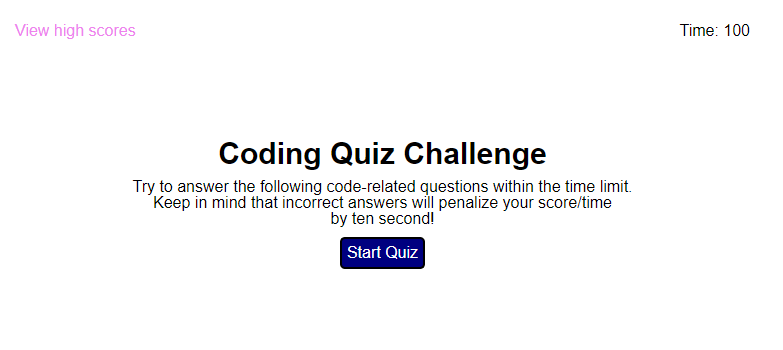

# Code-Quiz

## Description

This webpage is a code quiz on java fundamentals that stores the highest score.
There was no starter code and I created a basic HTML code with some elements that are hidden and some that are visible when the quiz starts. The elements will be hidden or visible and viceversa throughout the live of the game, depending on which button the user clicks. I was motivated to learn more about javascript using functions. I learned more how variables work in a global or blocked setting, and I look forward to improve my code afterwards to make it more efficient and less redundant, after I get to learn more in depth about the topics we have been studying the last few weeks.

## Usage

The game starts after pressing the start button, the screen will show a quiz and when the users select the wrong answer they will be deducted 20 seconds of time. The user who answers the most amount of correct answers in the least amount of time will score the highest score. After the quiz is finished the users will be prompted to enter their initials that will be saved in the localStorage that will be available even if the user closes the screen.

The button goBack will take the user to the main screen where the game beggins, and the button High Scores will take the user to see all the highest scores stored.

Link to the deployed app https://ginitadavis.github.io/Code-Quiz/

## License
Copyright (c) [2022] [Gina Davis]

Permission is hereby granted, free of charge, to any person obtaining a copy of this software and associated documentation files (the "Software"), to deal in the Software without restriction, including without limitation the rights to use, copy, modify, merge, publish, distribute, sublicense, and/or sell copies of the Software, and to permit persons to whom the Software is furnished to do so, subject to the following conditions:

The above copyright notice and this permission notice shall be included in all copies or substantial portions of the Software.

THE SOFTWARE IS PROVIDED "AS IS", WITHOUT WARRANTY OF ANY KIND, EXPRESS OR IMPLIED, INCLUDING BUT NOT LIMITED TO THE WARRANTIES OF MERCHANTABILITY, FITNESS FOR A PARTICULAR PURPOSE AND NONINFRINGEMENT. IN NO EVENT SHALL THE AUTHORS OR COPYRIGHT HOLDERS BE LIABLE FOR ANY CLAIM, DAMAGES OR OTHER LIABILITY, WHETHER IN AN ACTION OF CONTRACT, TORT OR OTHERWISE, ARISING FROM, OUT OF OR IN CONNECTION WITH THE SOFTWARE OR THE USE OR OTHER DEALINGS IN THE SOFTWARE.